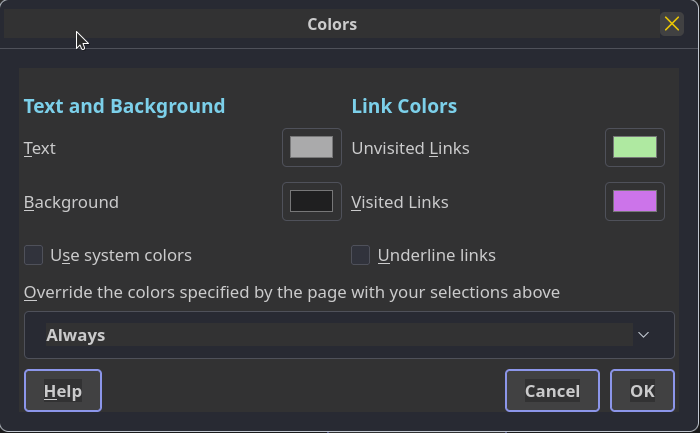
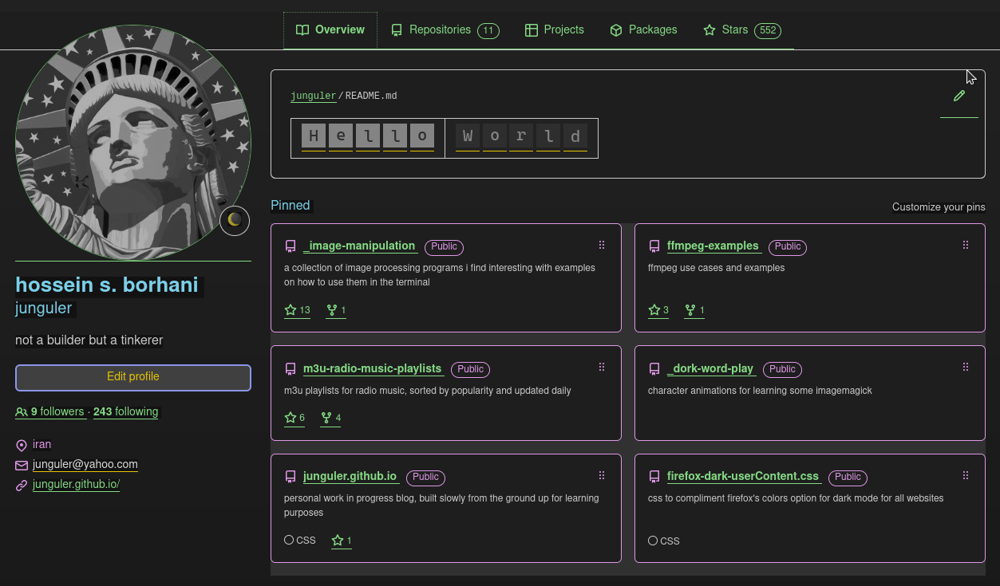
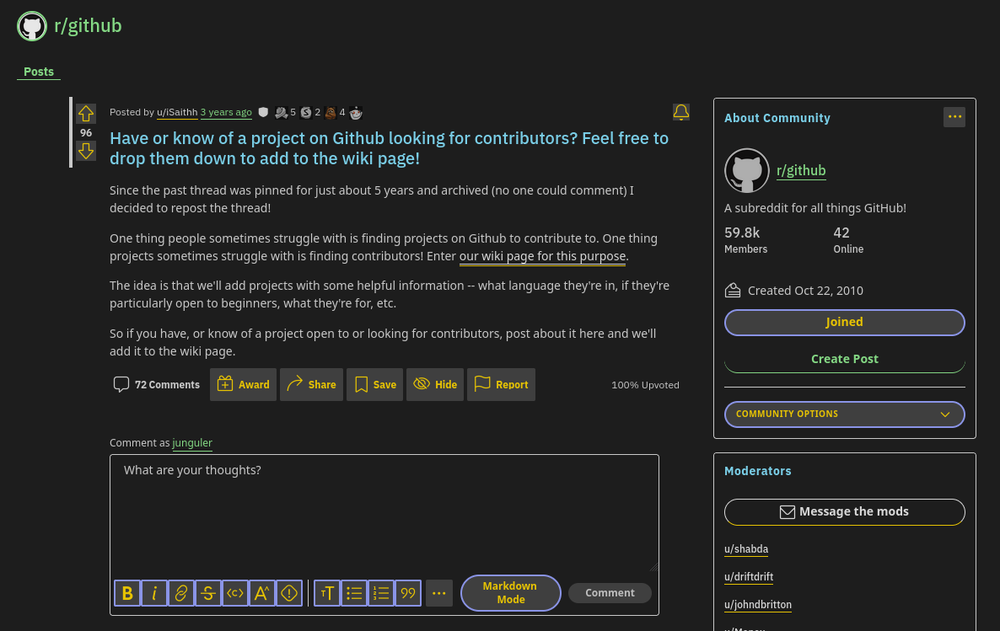
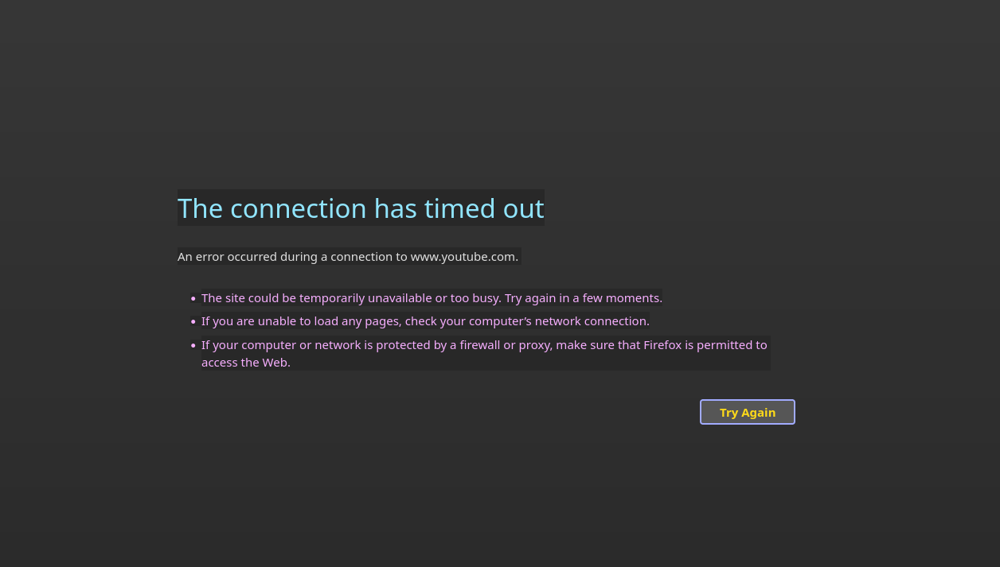

this css file is not meant to be used on it's own, i'm using it with the colors option from the firefox settings page

go to `settings` > `language and appearance` > `colors`

i have set `text` to light grey (#dddddd) and `background` (#111111) to dark grey, set `override the colors specified by the page with your selections above` to `always`
leave the `use system colors` and `underline links` ticked off (link colors can be set but we are overwritting them in the css file anyway)

to unlock the usage of custom css go to `about:config` search for `toolkit.legacyUserProfileCustomizations.stylesheets` and set it to `true`

if you find these color settings are not taking effect go to `about:config` search for `layout.css.prefers-color-scheme.content-override` and set it to `0`

to find your profile folder go to `about:support` click `Profile Directory` and `Open directory` - alternatively you can go to `about:profiles` click on `Root Directory` and `Open directory` depending on your os it might be called folder too (in both pages)

once you found the profile folder create a `chrome` folder inside and put this [userContent.css](https://raw.githubusercontent.com/junguler/firefox-dark-userContent.css/main/userContent.css) file inside it and restart firefox

set the firefox theme to dark in `about:addons` > `themes` and from there it should be a smooth experience without any white flashes before pages loading or when clicking on a link (tested under kubuntu 20.04 firefox 95)

 

here is how some of the popular websites look with this custom setup:

 

error pages are also in dark mode, no more blinding white background

 

things might change with this file in the future but i consider it usable and it's a direct improvement over the dark extensions i've used in the past, some pastal colors are used in different tags to give a bit of life to pages as they were quite two dimensional if you only used firefox's color option alone
