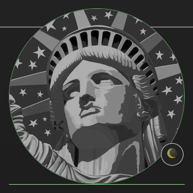

this css file is not meant to be used on it's own, i'm using it with the colors option from the firefox settings page

<br>

quick links:
* [how to use](https://github.com/junguler/firefox-dark-userContent.css#how-to-use)
* [the colors](https://github.com/junguler/firefox-dark-userContent.css#the-colors)
* [how it looks](https://github.com/junguler/firefox-dark-userContent.css#how-it-looks)
* [error page](https://github.com/junguler/firefox-dark-userContent.css#error-pages)
* workaround for white background from loading images 
  * [using inversion + hue-rotate](https://github.com/junguler/firefox-dark-userContent.css#using-inversion--hue-rotate)
  * [using scale](https://github.com/junguler/firefox-dark-userContent.css#using-scale)
  * [using opacity or brightness](https://github.com/junguler/firefox-dark-userContent.css#using-opacity-or-brightness)
* [remove/add rounded corners](https://github.com/junguler/firefox-dark-userContent.css#remove-rounded-corners)
* [website specific settings](https://github.com/junguler/firefox-dark-userContent.css#website-specific-settings)

<br>

## how to use?
go to `Settings` > `Language and Appearance` > `Colors`

i have set `text` to light grey #cccccc and `background` to dark grey #222222, set `override the colors specified by the page with your selections above` to `always`
leave the `use system colors` and `underline links` ticked off (link colors can be set but we are overwritting them in the css file anyway)

| Colors |
|---|
|  |

if you find these color settings are not taking effect go to `about:config` search for `layout.css.prefers-color-scheme.content-override` and set it to `0`

to unlock the usage of custom css go to `about:config` search for `toolkit.legacyUserProfileCustomizations.stylesheets` and set it to `true`

to find your profile folder go to `about:support` click `Profile Directory` and `Open directory` - alternatively you can go to `about:profiles` click on `Root Directory` and `Open directory` depending on your os it might be called folder too (in both pages)

once you found the profile folder create a `chrome` folder inside and put this [userContent.css](https://raw.githubusercontent.com/junguler/firefox-dark-userContent.css/main/userContent.css) file inside it and restart firefox

set the firefox theme to dark in `about:addons` > `themes` and from there it should be a smooth experience without any white flashes before pages loading or when clicking on a link (tested under bare metal running kubuntu 20.04 firefox 95.0.1 and a virtual machine running debian testing with firefox 91.4.0esr)

<br> 

## the colors
here is a list of some of the main colors used in this css file

| tags | info | rgb | hex |
|---|---|---|---|
| body | background color |  |  |
| body, p | text color |  |  |
| span | color of invisible spans of content |  |  |
| b, em, i, u, em, small | color of italic, emphesized and ... |  |  |
| h1, h2 | color of headers |  |  |
| ul, ol, li, del, dt, dd, optgroup, dl| color of some tables and borders |  |  |
| code, blockquote, q, nav, sup, sub, strong, mark, marker | color of quotes, code snippets, bold and ... |  |  |
| button, .btn | color of button borders |  |  |
| a:link | color of unclicked links |  |  |
| a:visited | color of visited links |  |  |
| a:hover | color of hovered links |  |  |
| a:active | color of active/clicked links |  |  |

note that some light grey and dark grey colors are inverted for the values to be easily visible

<br>

## how it looks
here is how some of the popular websites look with this custom setup (because this css file is being actively worked on some details might be different from the images shown here but the overal look and feel should be the same, i'll make sure to update these when i was satisfied with the state of the file)

| Github |
|---|
|  |

| StackOverFlow |
|---|
|  |

| Google Search |
|---|
|  |

| Youtube |
|---|
|  |

| Reddit |
|---|
|  |

| Mastodon |
|---|
|  |

| Archive.org |
|---|
|  |

<br>

## error pages
error pages are also in dark mode, no more blinding white background

| Error Page |
|---|
| |

| Risk Warning Error |
|---|
| |

| Wrong Proxy Error |
|---|
| |

<br>

## workaround for white background from loading images
if you are on a slow internet and notice many images loading with a white background even tho we have set dark background colors for images it's because most images have a white background baked into them, below is some methods i've come up with to somehow work around this annoyance, hovering mouse over the images in all examples below turns them to their default look

## using inversion + hue-rotate
applying a 75% inverting filter makes every instance of bright colors trun to dark and vise versa, this fixes the white background issue but makes the imaages harder to make out, we also apply white background color to these images since we want all pictures to be inverted and show a dark grey background color, the hue-rotate filter at 180 degrees turns every inverted color back to normal
```
img {
background: #ccc !important;
background-color: #ccc !important;
filter: brightness(.75) invert(75%) hue-rotate(180deg) !important;
transition: ease 0.25s !important;
}

img:hover {
filter: brightness(1) invert(0%) hue-rotate(0deg) !important;
transition: ease 0.25s !important;
}
```

| normal |
|---|
| | 

| inverted + hue-rotated |
|---|
|  |

this option is not perfect tho but it works for people with severe accessibility issues or eye fatigue, i'm not going to include this in the main file either as the majority of people probably don't need it

## using scale
another way to go about this is load the images at reduced sized and when you mouse is hovered over them they can go back to the normal size set by the website designer(s)
```
img {
transition: ease-in-out 0.25s !important;
scale: 50% !important;
}

img:hover {
transition: ease-in-out 0.25s !important;
scale: 100% !important;
}
```

| scale 50% <-> 100% |
|---|
|  |

you are not limited to always use these effects on websites, say only a few of the websites you go to load images at a big size (namely websites with backgorund images to download) add the address inside the code snipped below so these stylings are applied to those sites, separate websites with `,` or just make as many of these line as you want with different settings for each website

```
@-moz-document domain("free-images.com"), domain("rawpixel.com") {
img {
transition: ease-in-out 0.25s !important;
scale: 50% !important;
}

img:hover {
transition: ease-in-out 0.25s !important;
scale: 100% !important;
}
}
```
these effects will only apply to these two websites and does not effect others at all

<br>

## using opacity or brightness
using opacity we can change the images the least and still darken them enough to have a easy viewing experience, mouse hover is going to show the image in it's normal form
```
img {
transition: 0.5s ease !important;
opacity: .50 !important;
}

img:hover {
transition: 0.5s ease !important;
opacity: 1 !important;
}
```
| opacity 50% <-> 100% |
|---|
|  |

<br>

because our images are always on a dark background we can also use brightness filter to achive the same effect, one difference being if images are rendered on-top of tables, borders or other stuff they are not shown behind the images when brightness is used
```
img {
transition: 0.5s ease !important;
filter: brightness(50%) !important;
}

img:hover {
transition: 0.5s ease !important;
filter: brightness(100%) !important;
}
```

<br>

## remove rounded corners
this is pretty much down to preference but i don't like rounded corners in websites
```
* {
border-radius: 0% !important;
}
```
this will apply to everything on every website, if you just want to use it on images do not include these lines and just add `border-radius: 0% !important;` to the end of your `img` section

like the example above about white background on loading images this option is not included by default as it's quite niche and not to everyone's taste but use it if you like it

| default | not rounded |
|---|---|
|  |  |

<br>

you can use the same line for the opposite goal too, if you want all images to have rounded corners just do something like this:
```
img {
border-radius: 10% !important;
}
```

<br>

## website specific settings
because this file applies to every website you go to and it's impossible for me to style things for each of them or even check them some problems are bound to happen to a website you might frequent to, luckily you can apply your own stylings for these specific websites using this easy to use syntax
```
@-moz-document domain("google.com") {
p {
color: yellow !important;
}
}
```
the above example applies the `yellow` color to every paragraph of the `google.com` website even tho we specified a light grey color in the begining of the css file, because this line is written after that tag it takes precedent for that website alone

lets show some examples to make this easier to understand, we are applying a 75% brightness to all images (using the `img` tag) we see in websites using ``filter: brightness(.75)`` but i want images in image websites to be at 100% brightness, lets apply this to this two popular websites 
```
@-moz-document domain("free-images.com"), domain("rawpixel.com") {
img { 
filter: brightness(100%) !important; 
} 
}
```

you can use the same method to apply styles that are not present in the css file too, lets say you like rounded corner in all website that choose to include it but specifically want to remove them in github profile pages for avatars, a quick inspect element shows that this rounded border style is being applied using the `.avatar` class, knowing this let's remove it
```
@-moz-document domain("github.com") { .avatar { border-radius: 0% !important; } }
```

<br>

## still in beta status and actively worked on
things might change with this file in the future but i consider it usable and it's a direct improvement over the dark extensions i've used in the past, some pastal colors are used in different tags to give a bit of life to pages as they were quite two dimensional if you only used firefox's color option alone
