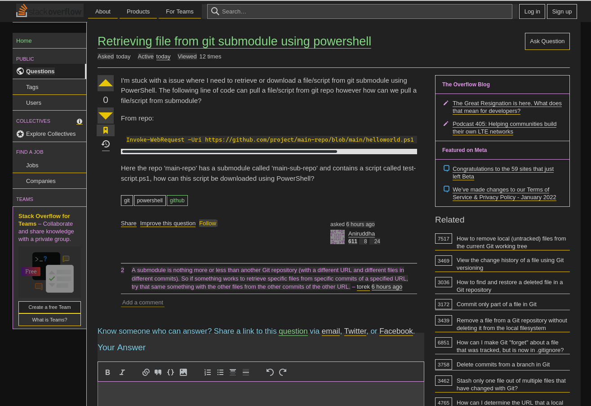

this css file is not meant to be used on it's own, i'm using it with the colors option from the firefox settings page

## how to use?
go to `Settings` > `Language and Appearance` > `Colors`

i have set `text` to light grey #cccccc and `background` to dark grey #222222, set `override the colors specified by the page with your selections above` to `always`
leave the `use system colors` and `underline links` ticked off (link colors can be set but we are overwritting them in the css file anyway)

| Colors |
|---|
|  |

to unlock the usage of custom css go to `about:config` search for `toolkit.legacyUserProfileCustomizations.stylesheets` and set it to `true`

if you find these color settings are not taking effect go to `about:config` search for `layout.css.prefers-color-scheme.content-override` and set it to `0`

to find your profile folder go to `about:support` click `Profile Directory` and `Open directory` - alternatively you can go to `about:profiles` click on `Root Directory` and `Open directory` depending on your os it might be called folder too (in both pages)

once you found the profile folder create a `chrome` folder inside and put this [userContent.css](https://raw.githubusercontent.com/junguler/firefox-dark-userContent.css/main/userContent.css) file inside it and restart firefox

set the firefox theme to dark in `about:addons` > `themes` and from there it should be a smooth experience without any white flashes before pages loading or when clicking on a link (tested under bare metal running kubuntu 20.04 firefox 95.0.1 and a virtual machine running debian testing with firefox 91.4.0esr)

<br>

## how it looks
here is how some of the popular websites look with this custom setup (because this css file is being actively worked on some details might be different from the images shown here but the overal look and feel should be the same, i'll make sure to update these when i was satisfied with the state of the file)

| Github |
|---|
|  |

| StackOverFlow |
|---|
|  |

| Google Search |
|---|
|  |

| Youtube |
|---|
|  |

| Reddit |
|---|
|  |

| Mastodon |
|---|
|  |

| Archive.org |
|---|
|  |

<br>

## error pages
error pages are also in dark mode, no more blinding white background

| Error Page |
|---|
| |

<br>

## remove white backgorund for loading images
if you are on a slow internet and notice many images loading with a white background even tho we have set dark background colors for images it's because most images have a white background baked into them, we can go around this by applying some inverting filters to images and revert them back when your mouse is hovering over the image, this will make the images harder to make out and it might result in hard to understand images but will help alleviate eye pain, edit the the css file and add these lines for the img and img:hover tag sections and remove the previous lines regarding the same tags
```
img, .img {
background: #ccc !important;
background-color: #ccc !important;
filter: brightness(.75) invert(75%) hue-rotate(180deg) !important;
transition: ease 0.25s !important;
}

img:hover, .img:hover {
filter: brightness(1) invert(0%) hue-rotate(0deg) !important;
transition: ease 0.25s !important;
}
```

| normal |
|---|
| | 

| without white background |
|---|
|  |

this option is not perfect tho but it works for people with severe accessibility issues or eye fatigue, i'm not going to include this in the main file either as the majority of people probably don't need it, i'm sure there is a better way to do this and i'm actively searching for it but i'm going to leave this here for the time being

<br>

## remove rounded corners
this is pretty much down to preference but i don't like rounded corners in websites
```
* {
border-radius: 0% !important;
}
```
this will apply to everything on every website, if you just want to use it on images do not include these lines and just add `border-radius: 0% !important;` to the end of your `img .img` section

like the example above about white background on loading images this option is not included by default as it's quite niche and not to everyone's taste but use it if you like it

| default | not rounded |
|---|---|
|  |  |

<br>

you can use the same line for the opposite goal too, if you want all images to have rounded corners just do something like this:
```
img, .img {
border-radius: 10% !important;
}
```

<br>

## still in beta status and actively worked on
things might change with this file in the future but i consider it usable and it's a direct improvement over the dark extensions i've used in the past, some pastal colors are used in different tags to give a bit of life to pages as they were quite two dimensional if you only used firefox's color option alone
